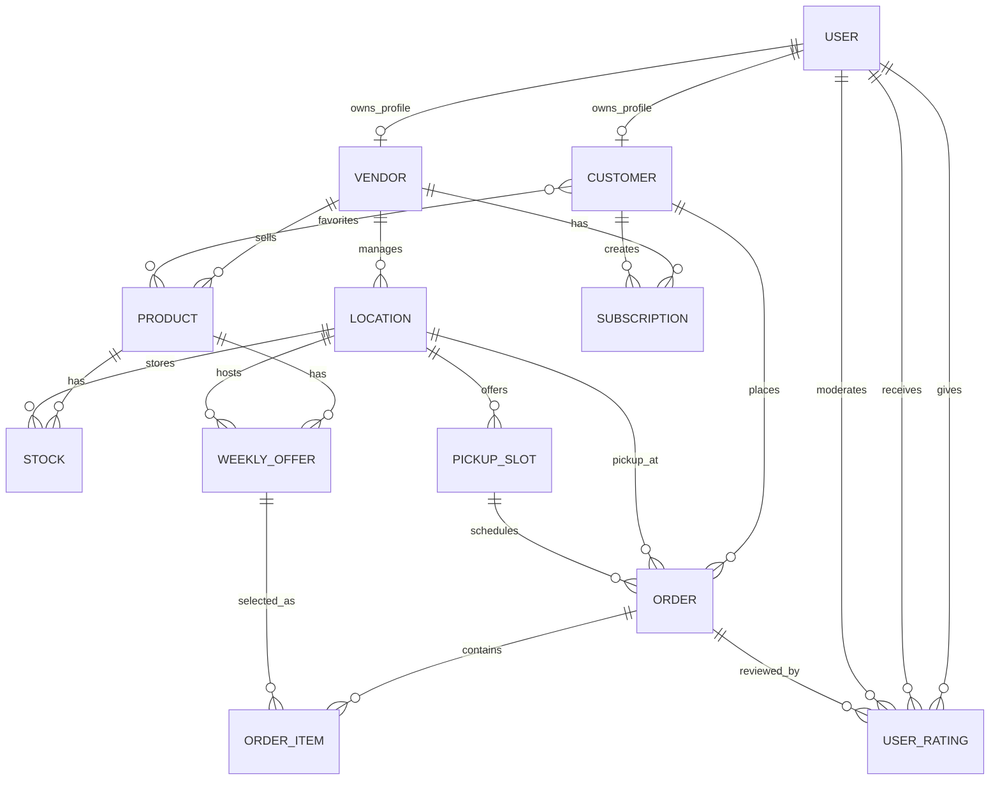

# Proxio

## Description

Proxio is a Spring Boot backend that simulates a simple marketplace between vendors and customers. Vendors can create and manage products and offers, while customers can browse, place orders, and interact with the platform. The system models a real flow of buying and selling products in a structured way.

## Architecture

Layered structure:
Controller → Service → Repository → Database

- Entity: defines the main objects in the system (users, products, orders, etc.)
- Repository: handles database interaction and basic CRUD operations
- Service: contains the application logic and coordinates operations between entities
- Controller: exposes REST endpoints for each entity
- Exception: handles errors in a consistent way

## Core Entities

- User: base account used in the system (can act as customer or vendor)
- Vendor: represents a seller that owns products and locations
- Customer: represents a buyer that can place orders
- Product: item sold by a vendor
- Location: physical place where products are available or picked up
- Stock: quantity of a product at a specific location
- WeeklyOffer: temporary offer for a product with price and availability
- PickupSlot: time interval when an order can be collected
- Order: a purchase made by a customer
- OrderItem: individual product entries inside an order
- Subscription: link between customer and vendor (e.g. for updates)
- UserRating: feedback between users after interactions

## Flow

A typical usage flow is:

- a user is created
- a vendor is created and linked to a user
- a customer is created and linked to a user
- the vendor defines locations
- the vendor creates products
- stock is assigned to products at locations
- weekly offers are created for products
- pickup slots are defined
- a customer places an order
- order items are added based on available offers
- users can rate each other after interactions

## ER Diagram



Relationship coverage:

- `@OneToOne`: `User` to `Vendor`, `User` to `Customer`
- `@OneToMany` / `@ManyToOne`: `Vendor` to `Product`, `Vendor` to `Location`, `Customer` to `Order`, `Order` to `OrderItem`
- `@ManyToMany`: `Customer` to favorite `Product`

## Cerinte Implementate

- Model de date: 12 entitati JPA interconectate, relatii `@OneToOne`, `@OneToMany`, `@ManyToOne`, `@ManyToMany`, plus diagrama ER de mai sus.
- CRUD complet: fiecare entitate are repository Spring Data JPA, service layer si controller REST cu operatii create/read/update/delete.
- Exception handling: exceptii dedicate pentru create, update, delete si not found, plus handler global pentru validare.
- Multi-environment: profil `dev` cu PostgreSQL si profil `test` cu H2 in-memory, in fisiere separate `application-dev.yaml` si `application-test.yaml`.
- Testing: teste unitare JUnit 5 + Mockito pentru service layer si 3 teste de integrare end-to-end cu MockMvc pentru signup, login si autorizare.
- Views si validare: UI Thymeleaf la `/ui`, formulare CRUD generice pentru toate entitatile, validare server-side Bean Validation, validare HTML5 client-side si pagini custom `404`/`500`.
- Logging: SLF4J + Logback, fisiere separate `app.log` si `errors.log`, plus aspect pentru logging automat pe service layer.
- Paginare si sortare: UI-ul `/ui/{entity}` foloseste `Pageable` pentru toate entitatile si optiuni de sortare configurate per entitate.
- Spring Security: autentificare prin `UserDetailsService` peste tabela `users`, roluri `USER`, `ADMIN`, `VENDOR`, `CUSTOMER`, endpoint-uri protejate pe rol, login custom, logout, BCrypt, remember-me si CSRF activ.
- Signup UI: formular disponibil la `/signup`; conturile noi pot fi shopper (`USER`) sau vendor (`VENDOR`).
- Marketplace UI: shopperii vad oferte saptamanale cu imagini, pot filtra dupa locatie, pot seta dimensiunea paginii, pot plasa comenzi si se pot abona la vendori.
- Vendor portal: vendorii au dashboard la `/vendor` si pot publica produse, stoc si weekly offers dintr-un singur formular.
- Ratings: shopperii pot lasa rating si comentariu pentru vendor dupa ce au plasat o comanda.
- Order completion: shopperii pot marca o comanda drept `Done`, apoi primesc un modal de rating cu selectie pe stelute.
- Vendor filtering: din pagina de subscriptions, `View offers` afiseaza doar ofertele vendorului selectat.
- Product uploads: vendorii pot incarca imagine proprie pentru produs; daca nu incarca, se foloseste imaginea categoriei.
- Vendor reputation: rating-ul mediu al vendorului este vizibil pe cardurile de oferte si subscriptions.
- Demo data: aplicatia porneste cu mai multi vendori, peste 30 de produse/oferte, pickup slots si subscriptions ca sa fie vizibile fluxurile si paginarea.
- Visual theme: UI-ul marketplace foloseste tema naturala/bio, imagini locale pe categorii de produse si layout responsive cu carduri mai late.

## UI

```bash
cd backend
docker compose up --build
```

Then open:

- Login: [http://localhost:8080/login](http://localhost:8080/login)
- Signup: [http://localhost:8080/signup](http://localhost:8080/signup)
- Market: [http://localhost:8080/market](http://localhost:8080/market)
- Vendor dashboard: [http://localhost:8080/vendor](http://localhost:8080/vendor)
- CRUD UI: [http://localhost:8080/ui](http://localhost:8080/ui)

Demo accounts:

- Admin: `admin@proxio.local` / `admin123`
- Shopper: `user@proxio.local` / `user123`
- Vendor: `vendor@proxio.local` / `vendor123`
- Extra vendors: `vendor2@proxio.local`, `vendor3@proxio.local`, `vendor4@proxio.local` / `vendor123`

## Run on Test

```
cd backend
./mvnw test
```


## Run on Dev

```
cd backend
docker compose up --build
```

Runs on [http://localhost:8080](http://localhost:8080)

## Unit Tests

```bash
mvn test
mvn test -Dtest="*ServiceTest"
```
