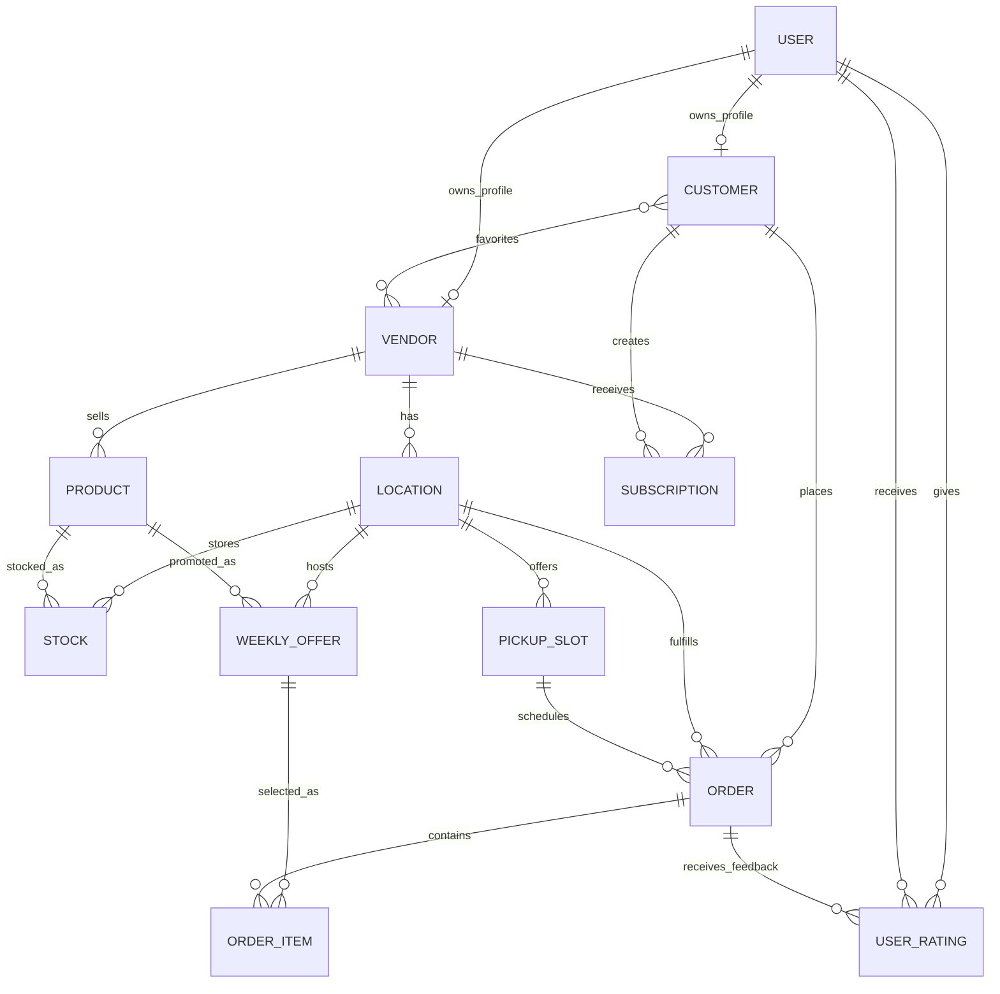

# Proxio

## Description

Proxio is a Spring Boot backend that simulates a simple marketplace between vendors and customers. Vendors can create and manage products and offers, while customers can browse, place orders, and interact with the platform. The system models a real flow of buying and selling products in a structured way.

## Architecture

Layered structure:
Controller → Service → Repository → Database

- Entity: defines the main objects in the system (users, products, orders, etc.)
- Repository: handles database interaction and basic CRUD operations
- Service: contains the application logic and coordinates operations between entities
- Controller: exposes REST endpoints for each entity
- Exception: handles errors in a consistent way

Optional microservice stack:

- `api-gateway`: centralized routing, request filtering, and rate limiting
- `backend`: main marketplace API
- `notification-service`: lightweight notification microservice
- `discovery-service`: service registry used by microservices and the gateway
- `config-service`: centralized configuration catalog for microservice settings
- `redis`: cache layer for frequently accessed marketplace summaries
- `prometheus` and `grafana`: observability stack for metrics and dashboards

## Core Entities

- User: base account used in the system (can act as customer or vendor)
- Vendor: represents a seller that owns products and locations
- Customer: represents a buyer that can place orders
- Product: item sold by a vendor
- Location: physical place where products are available or picked up
- Stock: quantity of a product at a specific location
- WeeklyOffer: temporary offer for a product with price and availability
- PickupSlot: time interval when an order can be collected
- Order: a purchase made by a customer
- OrderItem: individual product entries inside an order
- Subscription: link between customer and vendor (e.g. for updates)
- UserRating: feedback between users after interactions

## ER Diagram



Relationship coverage required by the project:

- `@OneToOne`: `User` to `Vendor`, `User` to `Customer`
- `@OneToMany` / `@ManyToOne`: `Vendor` to `Product`, `Vendor` to `Location`, `Customer` to `Order`, `Order` to `OrderItem`
- `@ManyToMany`: `Customer.favoriteVendors` to `Vendor.favoritedByCustomers`

## Flow

A typical usage flow is:

- a user is created
- a vendor is created and linked to a user
- a customer is created and linked to a user
- the vendor defines locations
- the vendor creates products
- stock is assigned to products at locations
- weekly offers are created for products
- pickup slots are defined
- a customer places an order
- order items are added based on available offers
- users can rate each other after interactions


## Run on Test

```
cd backend
set macro variable in .env to "test"
mvn spring-boot:run
```


## Run on Dev

```
cd backend
set macro variable in .env to "dev"
(optional -> only first time) docker compose up --build
docker compose up -d
```

Runs on [http://localhost:8080](http://localhost:8080)

## Unit Tests

```bash
mvn test
mvn test -Dtest="*ServiceTest"
```

## API Documentation

All resources expose standard CRUD endpoints:

- `POST /api/{resource}`
- `GET /api/{resource}`
- `GET /api/{resource}/{id}`
- `PUT /api/{resource}/{id}`
- `DELETE /api/{resource}/{id}`

Implemented resources:

- `users`, `vendors`, `customers`, `products`, `locations`, `stocks`
- `weekly-offers`, `pickup-slots`, `orders`, `order-items`
- `subscriptions`, `user-ratings`

Pagination and sorting endpoints:

- `GET /api/products/paged?page=0&size=10&sortBy=name&sortDir=asc`
- `GET /api/vendors/paged?page=0&size=10&sortBy=farmName&sortDir=asc`
- `GET /api/customers/paged?page=0&size=10&sortBy=id&sortDir=desc`

Authentication:

- `POST /api/auth/register`
- `POST /api/auth/login`
- `POST /logout`
- `GET /api/auth/csrf`

## Mandatory Requirements Checklist

- Model de date: 12 entities, documented ER diagram, one-to-one, one-to-many/many-to-one and many-to-many relationships.
- CRUD: Spring Data JPA repositories, service layer and REST controllers for every entity.
- Multi-environment: `application-dev.yaml` uses PostgreSQL, `application-test.yaml` uses H2.
- Testing: service-layer unit tests, Jacoco report, and MockMvc integration tests for paginated API scenarios.
- Views and validation: React frontend, client-side validation on product forms, Bean Validation on server models, friendly validation error responses.
- Logging: SLF4J with Logback, console logs, rolling app logs and separate rolling error logs.
- Pagination and sorting: products, vendors and customers support pageable/sortable API endpoints.
- Spring Security: custom login endpoint, role-based authorization, BCrypt password encoding, remember-me and CSRF cookie support.

## Frontend

```bash
cd frontend
npm install
npm run dev
```

The React app runs on [http://localhost:5173](http://localhost:5173) and calls the API gateway on [http://localhost:8081](http://localhost:8081).

## Deployment

The full optional stack can be started from the repository root with Docker Compose:

```bash
copy .env.example .env
docker compose up --build
```

Main URLs:

- Frontend: [http://localhost:5173](http://localhost:5173)
- API Gateway: [http://localhost:8081](http://localhost:8081)
- Backend: [http://localhost:8080](http://localhost:8080)
- Backend replica: internal Docker service `backend-replica:8080`
- Notification Service: [http://localhost:8082](http://localhost:8082)
- Discovery Service: [http://localhost:8761](http://localhost:8761)
- Config Service: [http://localhost:8888](http://localhost:8888)
- Redis: `localhost:6379`
- Prometheus: [http://localhost:9090](http://localhost:9090)
- Grafana: [http://localhost:3000](http://localhost:3000)

Grafana default credentials:

- username: `admin`
- password: `admin`

## Optional Requirements Added

- Lightweight service registry through `discovery-service`
- Centralized configuration catalog through `config-service`
- Automatic registration and heartbeat for `backend` and `notification-service`
- Gateway-side discovery with static URL fallback for local development
- Client-side round-robin load balancing across discovered service instances
- Resilience in the gateway through retry, timeout, and JSON fallback response
- Circuit breaker per upstream service with `/gateway/circuit-breakers` status
- Distributed internal security with short-lived HMAC tokens from gateway to services
- Redis caching for the product summary endpoint, including `X-Cache: MISS/HIT` demo headers
- AI/runtime search enhancement endpoint with product relevance scoring
- Centralized routing through `api-gateway`
- Request filtering with correlation headers in the gateway
- Basic rate limiting in the gateway
- Independent `notification-service` microservice
- Actuator and Prometheus metrics for all microservices
- Grafana dashboard provisioning for health, requests, CPU, and memory
- GitHub Actions CI pipeline for backend, gateway, discovery service, notification service, and frontend
- Strangler Fig migration pattern documented: the gateway keeps the old marketplace API behind one route while new independent services (`notification-service`, `discovery-service`, `config-service`) are added around it.

## Demo Endpoints

- `GET /api/products/paged`
- `POST /api/auth/login`
- `GET /api/notifications/templates`
- `POST /api/notifications/send-test`
- `GET /api/notifications/ops/status`
- `GET /api/discovery/services`
- `GET /api/discovery/services/backend`
- `GET /api/discovery/services/config-service`
- `GET /api/config/backend/dev`
- `GET /api/products/summary`
- `GET /api/ai/search?query=fresh%20honey&limit=5`

Notification service sample payload:

```json
{
  "recipient": "demo@proxio.test",
  "channel": "email",
  "message": "Fresh apples are back in stock."
}
```

Observability endpoints:

- `http://localhost:8080/actuator/health`
- `http://localhost:8081/actuator/health`
- `http://localhost:8082/actuator/health`
- `http://localhost:8761/actuator/health`
- `http://localhost:8888/actuator/health`
- `http://localhost:8080/actuator/prometheus`
- `http://localhost:8081/actuator/prometheus`
- `http://localhost:8082/actuator/prometheus`
- `http://localhost:8761/actuator/prometheus`
- `http://localhost:8888/actuator/prometheus`

Load balancing demo:

```bash
docker compose up --build
curl http://localhost:8081/api/discovery/services/backend
curl -i http://localhost:8081/api/products/paged
curl -i http://localhost:8081/api/products/paged
```

The gateway adds `X-Upstream-Service` and `X-Upstream-Base-Url` headers, so repeated requests show traffic rotating between `backend:8080` and `backend-replica:8080` after both instances register.

Centralized config demo:

```bash
curl http://localhost:8081/api/config/backend/dev
curl http://localhost:8081/api/config/api-gateway/dev
```

Redis cache demo:

```bash
curl -i http://localhost:8081/api/products/summary
curl -i http://localhost:8081/api/products/summary
```

The first call should return `X-Cache: MISS`; the second call should return `X-Cache: HIT` while Redis is running.

Distributed security demo:

- In Docker, backend and notification service use `INTERNAL_AUTH_ENABLED=true`.
- Requests routed through the gateway receive a signed `X-Internal-Token`.
- Direct calls to secured service endpoints without the internal token are rejected while actuator endpoints stay public for Prometheus.
- Try `curl http://localhost:8081/api/notifications/ops/status` through the gateway, then compare with direct access on `http://localhost:8082/api/notifications/ops/status`.

AI runtime/search enhancement demo:

```bash
curl "http://localhost:8081/api/ai/search?query=fresh%20honey&limit=5"
```
